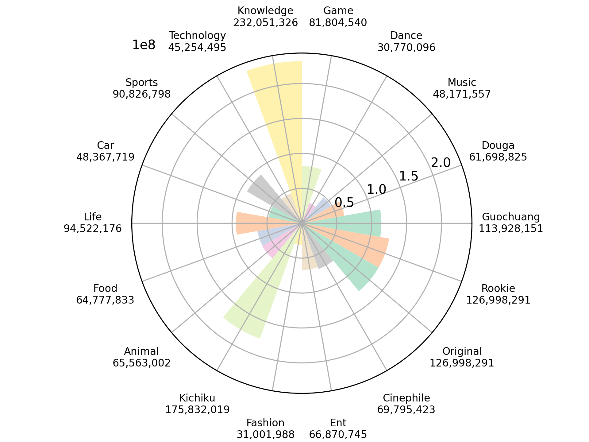

# Visualization
For Data Visualization Technique Class in 2024

# How to Start
create new conda environment
```
conda create -n bilibili python=3.8.20
```
create new conda environment
```
conda activate bilibili
pip install -r requirements.txt
```

# Result
```
python rankVIS.py
```


```
python hotVIS.py
```


```
python danmuVIS.py
```


